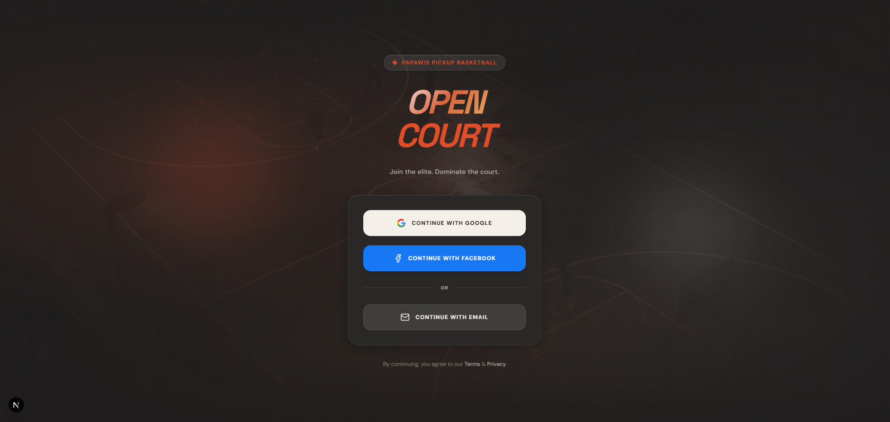

# 🏀 OpenCourt — User Manual

> **OpenCourt** is a basketball run management platform that lets players find, join, and host pickup basketball games in their area.

---

## Table of Contents

1. [Getting Started — Creating an Account](#1-getting-started--creating-an-account)
2. [Completing Your Profile](#2-completing-your-profile)
3. [The Dashboard — Finding a Run](#3-the-dashboard--finding-a-run)
4. [Joining a Run](#4-joining-a-run)
5. [Viewing a Game's Details](#5-viewing-a-games-details)
6. [Hosting a Run](#6-hosting-a-run)
7. [Managing Your Schedule](#7-managing-your-schedule)
8. [Account Settings](#8-account-settings)
9. [Your Profile Page](#9-your-profile-page)
10. [Check-In System (QR Code)](#10-check-in-system-qr-code)
11. [Host Controls](#11-host-controls)

---

## 1. Getting Started — Creating an Account

Visit **[opencourtph.vercel.app](https://opencourtph.vercel.app)** — you will land on the login page.



### Sign-up Options

| Method | How |
|---|---|
| **Google** | Click **Continue with Google** — instant sign-in with your Google account |
| **Facebook** | Click **Continue with Facebook** |
| **Email** | Enter your email + password and click **Sign Up** |

> **First-time users:** After signing in for the first time, you will be taken to a **Profile Completion** screen before reaching the dashboard.

### Email Login — Failed Attempt Protection

If you sign in with email and enter the wrong password repeatedly:

| Attempt | What Happens |
|---|---|
| 1–3 | Red inline error: "Invalid login credentials" |
| 4 | Amber warning banner: **"1 attempt remaining before your account is locked for 15 minutes"** + Forgot Password button |
| 5+ | Red lockout banner: **"Account temporarily locked. Try again in 15 minutes."** — submit button disabled |

> Clicking **Forgot your password?** sends a reset link to your email. The link redirects you to Settings where you can set a new password. This protection only applies to email/password login — Google and Facebook sign-in are unaffected.

---

## 2. Completing Your Profile

After your first login, you will be redirected to the **Onboarding** page. This is required before you can use the app.

### Required Fields

| Field | Description |
|---|---|
| **Full Name** | Your real name (pre-filled from Google/Facebook if available) |
| **Display Name** | Your username — this appears on game rosters (min. 3 characters) |

### Optional Fields

| Field | Description |
|---|---|
| Position | Your preferred position (Point Guard, Shooting Guard, etc.) |
| Height | Your height |
| Skill Level | Beginner / Casual / Competitive / Elite |

Click **Complete Profile** to save and proceed to the dashboard.

> 💡 You can update all of these fields later on your **Profile Page**.

---

## 3. The Dashboard — Finding a Run

The **Dashboard** (`/dashboard`) is the main hub — it shows all upcoming basketball games in your area.

### Layout

```
┌────────────────────────────────────────────────────────┐
│  🛜 LIVE GAMES      FIND YOUR RUN                       │
│  5 games happening near you this week                   │
│                                                         │
│  [ALL] [TODAY 🔥] [NEAR ME 📍]                          │
│                                                         │
│  ┌──────────────┐ ┌──────────────┐ ┌──────────────┐   │
│  │ Game Card    │ │ Game Card    │ │ + HOST A RUN │   │
│  └──────────────┘ └──────────────┘ └──────────────┘   │
└────────────────────────────────────────────────────────┘
```

### Filters

| Filter | Shows |
|---|---|
| **All** | Every upcoming game |
| **Today 🔥** | Only games scheduled today |
| **Near Me 📍** | Games sorted by proximity (requires location permission) |

### Game Cards

Each card shows:
- **Game title** and location
- **Schedule** — day and time (e.g., Thu, Mar 19 @ 7:00 PM)
- **Roster** — current players / max players with a fill bar
- **Entry fee** — Free or paid amount
- **JOIN RUN** button — or **CONFIRMED** if you've already joined

> **Cancelled games** appear grayed out (reduced opacity, grayscale) with a red **CANCELLED** badge and the host's cancellation reason. The join button is hidden.

> 🔴 **Live Updates** — New games posted by other users appear automatically without needing to refresh the page. A **🏀 New game just posted!** toast notification appears for 5 seconds when this happens.

> **Dashboard count** only reflects games that are upcoming (not yet started), not cancelled, and not completed.

---

## 4. Joining a Run

### From the Dashboard

1. Find a game card on the dashboard
2. Click **JOIN RUN**
   - If the game has **House Rules**, a modal will appear — read and click **I AGREE & JOIN THE RUN**
   - If the game is **full**, the button changes to **JOIN THE WAITLIST**
3. The button changes to **CONFIRMED** once you've successfully joined

### From the Game Detail Page

1. Click anywhere on a game card to open its full detail page
2. Review the full game details (format, location, schedule, description, house rules)
3. Click **+ JOIN THE RUN** in the hero section

---

## 5. Viewing a Game's Details

Click any game card to open its detail page (`/game/[id]`).

### Sections

#### Hero Section
- Game title, format badge, skill level badge
- Location and schedule
- **Hosted By** card — shows the host's display name and reliability score

#### Game Info
- **The Run** — game description
- **House Rules** — if set by the host
- **Run Intel** — format, level, cost, current status

#### Squad Roster
Shows all confirmed players with:
- Avatar / initials
- Display name
- Position and skill level
- Status badge (Joined / Checked In / Absent)

#### Waitlist
Players waiting for a spot if the roster is full.

#### Team Generator *(Host only)*
Automatically splits the squad into balanced teams based on skill and position.

#### Game Stats *(Completed games only)*
Players can log their individual performance stats after a game is marked complete.

---

## 6. Hosting a Run

Click **+ HOST RUN** in the top navigation or on the My Schedule page.

The wizard has **5 steps**:

### Step 1 — Location & Schedule

| Field | Notes |
|---|---|
| **Game Title** | Optional — auto-generated if left blank |
| **Location** | Court name or address |
| **Date** | Today / Tomorrow / Pick a specific date |
| **Start Time** | Time picker (e.g., 7:00 PM) |

> 💡 If you've hosted games before, your **Usual Courts** will appear as quick-select buttons.

### Step 2 — Format

| Field | Options |
|---|---|
| **Game Format** | Full Court (with Ref), Full Court (no Ref), Half Court, 3-on-3 |
| **Max Players** | 15 / 20 / 25 (default: 20) |
| **Competition Level** | Beginner, Casual, Competitive, Elite, Open Run |

### Step 3 — Details *(Optional)*

- **Description** — e.g., "Bring dark and light jerseys"
- **House Rules** — e.g., "No trash talk, winner stays, 2s and 3s only"

### Step 4 — Filters *(Optional)*

- **Gender** — Mens / Womens / Mixed
- **Age Range** — All ages / 12U / 14U / 17U / 18+ / 40+

### Step 5 — Confirm & Publish

Review a summary card showing:
- Game title and location
- **Date and time** (e.g., Mon, Mar 23 @ 7:00 PM)
- Total slots and filter settings
- **Entry cost** — enter an amount or leave as "Free"

Click **⚡ PUBLISH GAME** to create the run. You'll be redirected to the dashboard and your game will appear immediately for all users.

---

## 7. Managing Your Schedule

Navigate to **My Schedule** (`/my-games`) via the sidebar calendar icon.

### Upcoming Runs

Shows all games you have **joined** as a player, sorted by date:
- Next upcoming game is highlighted with a **"Next Up"** indicator
- Each card shows the game details and a **CONFIRMED** badge

### Hosted by You

Shows all games you have **created** as a host:
- **OPEN RUN** / **CANCELLED** / **COMPLETED** status badges
- Quick access to manage each game

---

## 8. Account Settings

Navigate to **Settings** (`/settings`) via the **Menu** page (tap the Settings icon in the top-right of the Menu).

### Change Password *(Email users only)*

If you signed up with an email and password, you can update your password here:

1. Enter your **New Password** (minimum 8 characters)
2. Enter it again in **Confirm New Password**
3. Click **Update Password**

A green confirmation appears on success.

> **Google / Facebook users:** Password management is handled by your provider. The Change Password form is replaced with a note explaining this.

---

## 9. Your Profile Page

Navigate to **Profile** (`/profile`) via the sidebar person icon.

### What You Can Edit

| Field | Description |
|---|---|
| **Full Name** | Your real name |
| **Display Name** | Your username shown on rosters |
| **Position** | Preferred court position |
| **Height** | Feet and inches |
| **Skill Level** | Self-assessed skill level |
| **Avatar** | Profile picture URL |

Click **Save Changes** to update your profile.

### Stats Summary

Below the edit form, your stats are displayed:
- **Games Played**
- **Reliability Score** — calculated based on check-in history (starts at 100%)
- **Win Rate** *(if game stats have been logged)*

---

## 10. Check-In System (QR Code)

OpenCourt uses a **QR code check-in system** to confirm player attendance on game day.

### As a Player

1. Go to the game detail page
2. Click **📱 SHOW CHECK-IN QR**
3. A QR code "Player Pass" modal appears
4. Show this QR code to the host when you arrive at the court

### As a Host

1. Go to the game detail page
2. Click **📷 SCAN MODE** in the Squad Roster section
3. Point your camera at each player's QR code
4. Players are automatically marked as **Checked In ✅**

> ⚠️ **Reliability Score impact:** Being marked **Absent** by the host will lower your reliability score. Being **Checked In** maintains your score.

---

## 11. Host Controls

As the game host, you have additional controls on the game detail page.

### Roster Actions (per player)

| Button | Action |
|---|---|
| ✅ Green checkmark | Mark player as **Present** (Checked In) |
| ❌ Red X | Mark player as **Absent** |
| 🗑️ Trash | **Kick** player from the squad |
| RESET | Revert a marked player back to **Joined** |

### Waitlist Actions

If players are on the waitlist and a spot opens:
- Click **SQUAD UP** to promote a waitlisted player to the main roster

### Game Lifecycle

| Action | When to Use |
|---|---|
| **✅ COMPLETE RUN** | After the game is finished — unlocks stat logging for all checked-in players |
| **❌ CANCEL RUN** | If the game can't happen — requires a cancellation reason that is shown to all joined players |

### Team Generator

Once your squad is set (minimum **10 confirmed players**):
1. Click **Generate Teams** to auto-split players into 2 balanced teams using OVR scores (stats + skill level)
2. Drag-and-drop players between Team Dark, Team Light, and the Unassigned pool to adjust
3. Click **Save Lineup** to persist changes
4. Click **Publish Matchup** to make teams visible to all joined players

---

## Quick Reference

| Icon | Page |
|---|---|
| 🏠 Home icon | Dashboard |
| 📅 Calendar icon | My Schedule |
| ➕ Plus icon | Host a Run |
| 👤 Person icon | Profile |

---

## Reliability Score

Your **Reliability Score** starts at **100%** and changes based on your behavior:

| Event | Impact |
|---|---|
| ✅ Checked in by host | Score maintained |
| ❌ Marked absent | Score decreases |
| Consistent attendance | Score recovers over time |

A high reliability score signals to hosts that you're dependable — aim to keep it above **80%**.

---

*Last updated: April 2026 · OpenCourt v1.0*
